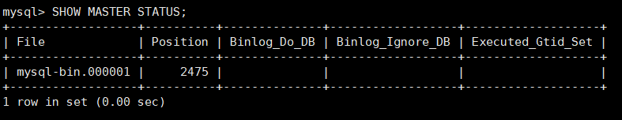
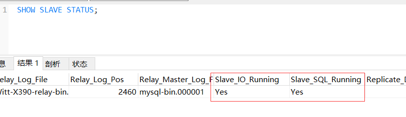

# EntityFrameworkCore.MasterSlave

## MySQL主从配置

### Master数据库  
    ```
    RESET MASTER
    ```
功能说明：删除所有的binglog日志文件，并将日志索引文件清空，重新开始所有新的日志文件。用于第一次进行搭建主从库时，进行主库binlog初始化工作；

1. 修改配置文件
    ```
    server-id	= 1 # 在同一个集群中，server-id不能重复
    # 忽略的数据库
    # binlog-ignore-db=information_schema 
    # binlog-ignore-db=performance_schema
    # binlog-ignore-db=mysql

    # 需要同步的数据库 不指定默认为所有
    binlog-do-db=test

    # 配置数据库日志信息
    log_bin		= /var/log/mysql/mysql-bin.log # 日志路径
    expire_logs_days= 10 # 日志过期天数
    max_binlog_size	= 100M # 最大日志大小

    ```

    重启数据库
    ```
    sudo systemctl restart mysql.service
    ```
2. 数据库配置

    创建用户并授权用于Slave库访问Master库  
    ```
    CREATE USER 'slavuser'@'%' IDENTIFIED BY 'slavepass'; # 建立用户
    GRANT REPLICATION SLAVE, REPLICATION CLIENT ON *.*  TO 'slavuser'@'%'; # 赋予REPLICATION权限 
    ```

    查看二进制日志信息

    ```
    SHOW MASTER STATUS; # 主服务器的二进制日志信息 结果如下
    ```
    

    
### Slave数据库  
1. 修改配置文件
    ```
    server-id	= 1 # 在同一个集群中，server-id不能重复
    # replicate-ignore-db=mysql  # 忽略的数据库 生产库上不建议设置过滤规则。如果非要设置，那就用replicate-wild-ignore-table
    # replicate-wild-ignore-table= mysql.%  # 忽略的数据库表

    # replicate-do-db=db_name # 需要复制的数据库 不指定默认为所有

    # 配置数据库日志信息 
    log_bin		= /var/log/mysql/mysql-bin.log # 日志路径
    expire_logs_days= 10 # 日志过期天数
    max_binlog_size	= 100M # 最大日志大小

    ```

    重启数据库
    ```
    sudo systemctl restart mysql.service
    ```
2. 数据库配置

    ```
    CHANGE MASTER TO master_host='192.168.31.101', master_user='slaveuser', master_password='slavepass', master_log_file='mysql-bin.000001', master_log_pos=2475;
    ```
    master_host：主数据库的ip地址  
    master_log_file: 前面查询到的主服务器日志文件名(File)  
    master_log_pos: 前面查询到的主服务器日志文件位置(Position)  

3. 查看开启状态
    ```
    SHOW SLAVE STATUS;
    ```
      
    如果这Slave_IO_Running、Slave_SQL_Running选项不全是Yes，那就说明你前面某个步骤配置错了。
    
  4. 清除从库配置
    
    ```
    STOP SLAVE;
    ```
    
    ```
    RESET SLAVE ALL;
    ```
  
  
